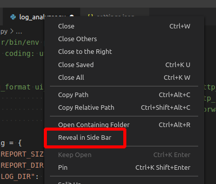

# Change Log

All notable changes to the "Visual Studio Code Personal Settings and Extension" extension will be documented in this file.

## 0.1.0 - 2023-09-07

- Initial release

## 0.2.0 - 2023-09-09

- Add Extensions NOT Included but might be useful content
  - [JSON to CSV]
  - [Edit csv]
  - [Rainbow CSV]
  - [REST Client]

## 0.3.0 - 2023-09-14

- 新增 `showActiveFileInExplorer` (檔案: 在[總管檢視]中顯示使用中檔案)快速鍵

## 0.4.0 - 2023-09-25

- Add Extensions
  - [IntelliCode]

- 新增一些全域設定
