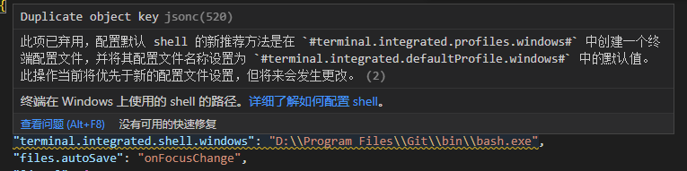
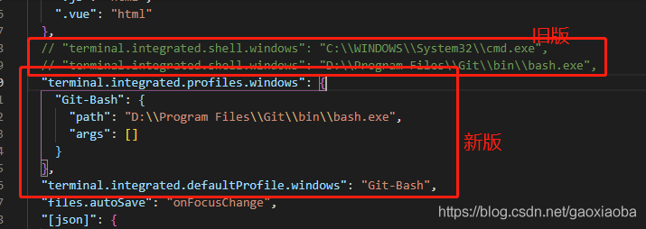

# Visual Studio Code Personal Settings and Extension

## Extensions Included

- [Chinese (Traditional) Language Pack for Visual Studio Code](https://marketplace.visualstudio.com/items?itemName=MS-CEINTL.vscode-language-pack-zh-hant)\
    將 Vscode 中文化的插件，可以在網路上搜尋教學安裝

- [Live Server](https://marketplace.visualstudio.com/items?itemName=ritwickdey.LiveServer)\
    更改前端html 或 css 樣式的時候可以即時在瀏覽器預覽成果
    ```json
    {
        // 一般來說我們常用8080
        "liveServer.settings.port": 8080,
        // 不用每次開起LiveServer就跳出通知
        "liveServer.settings.donotShowInfoMsg": true,
    }
    ```

- [Chinese Lorem](https://marketplace.visualstudio.com/items?itemName=KevinYang.ctlorem)\
    VSCode 本身是有內建假字生成器(Lorem)，但是有時候我們會希望假字生成是中文的假字而不是英文，那麼這時候就可以使用 Chinese Lorem 這個套件，使用方法也很簡單，將原本的 `lorem` 改成 `ctlorem` + `tab` 就可以了。

- [Material Icon Theme](https://marketplace.visualstudio.com/items?itemName=PKief.material-icon-theme)\
    更改icon 的圖示，還可以更改資料夾的顏色讓分辨資料更方便

- [Polacode](https://marketplace.visualstudio.com/items?itemName=pnp.polacode)\
    程式碼截圖非常漂亮的話，那麼就是使用這個套件做的，使用方式基本上就是 `F1` 然後輸入 `Polacode` 就可以開始程式碼截圖。

- [IntelliCode](https://marketplace.visualstudio.com/items?itemName=VisualStudioExptTeam.vscodeintellicode)\
    微軟 AI 輔助程式碼開發，提供人工智慧輔助的 IntelliSense。 

- [Office Viewer(Markdown Editor)](https://marketplace.visualstudio.com/items?itemName=cweijan.vscode-office&fbclid=IwAR0AUecGlpmvlrX_jrKNaO9MYYVV_hKTB6ajjb2rpH4wQHLRA339C1pN9XE)
    開啟任意 *.md 文件就會直接用「所見即所得」(WYSIWYG) 的方式編輯 Markdown 文件，尤其是在 Markdown 文件中編輯表格有夠方便！👍

## Extensions NOT Included but might be useful

You need to install the following extensions manually if you need:\
(如果需要，您需要手動安裝以下擴展：)

- [Atom Keymap](https://marketplace.visualstudio.com/items?itemName=ms-vscode.atom-keybindings)
- [Code Spell Checker](https://marketplace.visualstudio.com/items?itemName=streetsidesoftware.code-spell-checker)\
    能够帮助我们检查单词拼写是否出现错误，检查的规则遵循 camelCase (驼峰拼写法)

- [VS Code Snippet Generator](https://marketplace.visualstudio.com/items?itemName=dkultasev.vs-code-snippet-generator)

- [vscode-pdf](https://marketplace.visualstudio.com/items?itemName=tomoki1207.pdf)\
    在 vscode 打開 PDF 檔案

- [Excel Viewer](https://marketplace.visualstudio.com/items?itemName=GrapeCity.gc-excelviewer)\
    資料分析的時候，常需要邊寫程式，邊打開原始資料 excel 檔案確認內容，Excel Viewer 能夠在 VSCode 中讀取 excel 檔案，也支援基本的功能 eg. Filter, Sort。

- [Peacock](https://marketplace.visualstudio.com/items?itemName=johnpapa.vscode-peacock)\
    工作區域改變顏色。操作說明: [Peacock for VS Code：为你的窗口添上五彩斑斓的色彩](https://zhuanlan.zhihu.com/p/84175150)

- [Comment Translate](https://marketplace.visualstudio.com/items?itemName=intellsmi.comment-translate)\
    許多優秀的項目，都有豐富的注釋，使用者可以快速理解代碼意圖。但是如果使用者並不熟習注釋的語言，會帶來理解困難。 本外掛程式使用 Google、Bing、Baidu、AliCloud、DeepL等的 Translate API 翻譯 VSCode 的程式設計語言的注釋。

- [CodeSnap](https://marketplace.visualstudio.com/items?itemName=adpyke.codesnap)\
    程式碼轉圖片

- [Swagger Viewer](https://marketplace.visualstudio.com/items?itemName=Arjun.swagger-viewer)\
    在撰寫 Swagger OpenAPI 文件時可以方便地預覽

- [YAML](https://marketplace.visualstudio.com/items?itemName=redhat.vscode-yaml)\
    讓 VSCode 支援 YAML 格式

- [Live Share](https://marketplace.visualstudio.com/items?itemName=MS-vsliveshare.vsliveshare)\
    當您與您的團隊成員一起解決問題，並希望在編輯器上共同處理相同的程式碼時，這將幫助您將程式碼編輯器的控制權交給您的團隊成員，您可以同時處理它。

- [REST Client](https://marketplace.visualstudio.com/items?itemName=humao.rest-client)\
    這個擴充套件允許你做一個HTTP請求，並在VSCode中直接檢視響應，而不是在兩個應用程式之間切換，這個擴充套件為你做這個工作。

- [JSON to CSV](https://marketplace.visualstudio.com/items?itemName=khaeransori.json2csv)
    Convert JSON to CSV, and CSV to JSON.

- [Edit csv](https://marketplace.visualstudio.com/items?itemName=janisdd.vscode-edit-csv)
    extension to edit csv files with a table ui

- [Rainbow CSV](https://marketplace.visualstudio.com/items?itemName=mechatroner.rainbow-csv)
    Highlight CSV and TSV files, Run SQL-like queries

- [REST Client](https://marketplace.visualstudio.com/items?itemName=humao.rest-client)
    REST Client for Visual Studio Code

## Extension Settings

## Preferences Settongs

> `File` => `Preferences` => `Settings`

- Terminal 選取預設殼層
    > 當 VSCode 升級至 1.57.1(2021.6.17) 時，會出現警告提示：\
    > 此項已棄用，配置預設 shell 的新推薦方法是在 `#terminal.integrated.profiles.windows#`  中創建一個終端設定檔，並將其設定檔名稱設置為 `#terminal.integrated.defaultProfile.windows#`  中的預設值。此操作當前將優先於新的設定檔設置，但將來會發生更改。\
    >  
    > - Command Prompt：`"terminal.integrated.shell.windows": "C:\\Windows\\System32\\cmd.exe"`
    > - PowerShell：`"terminal.integrated.shell.windows": "C:\\Windows\\System32\\WindowsPowerShell\\v1.0\\powershell.> exe"`
    > - Git Bash：`"terminal.integrated.shell.windows": "C:\\Program Files\\Git\\bin\\bash.exe"`
    > - Bash on Ubuntu (on Windows)：`"terminal.integrated.shell.windows": "C:\\Windows\\System32\\bash.exe"`

    新版設定：
    ```json
    "terminal.integrated.profiles.windows": {
        "PowerShell": {
            "source": "PowerShell",
            "icon": "terminal-powershell"
        },
        "Command Prompt": {
            "path": [
                "${env:windir}\\Sysnative\\cmd.exe",
                "${env:windir}\\System32\\cmd.exe"
            ],
            "args": [],
            "icon": "terminal-cmd"
        },
        "Git Bash": {
            "source": "Git Bash"
        }
    },
    "terminal.integrated.defaultProfile.windows": "Command Prompt"
    ```
    
    資料來源：https://blog.csdn.net/gaoxiaoba/article/details/118191161

- 個人化全域設定檔
    - `Ctrl + Shift + P` 打開命令面板，然後輸入 "Personal Change Settings" 並執行命令。

    ```json
    {
        "window.zoomLevel": 1,
        "editor.fontSize": 16,
        "editor.tabSize": 2,
        "workbench.sideBar.location": "right",
        "files.eol": "\n",
        "editor.wordWrap": "on",
        "editor.minimap.enabled": false,
        "editor.renderWhitespace": "boundary"
    }
    ```

- keyboard shortcuts

| 命令                                            | 按鍵繫節關係     | 說明                               |
| ----------------------------------------------- | ---------------- | ---------------------------------- |
| editor.action.transformToUppercase              | ctrl + shift + u | 轉換到大寫                         |
| editor.action.transformToLowercase              | ctrl + shift + l | 轉換到小寫                         |
| workbench.files.action.showActiveFileInExplorer | shift + alt + l  | 檔案: 在[總管檢視]中顯示使用中檔案 |

**Enjoy!**
